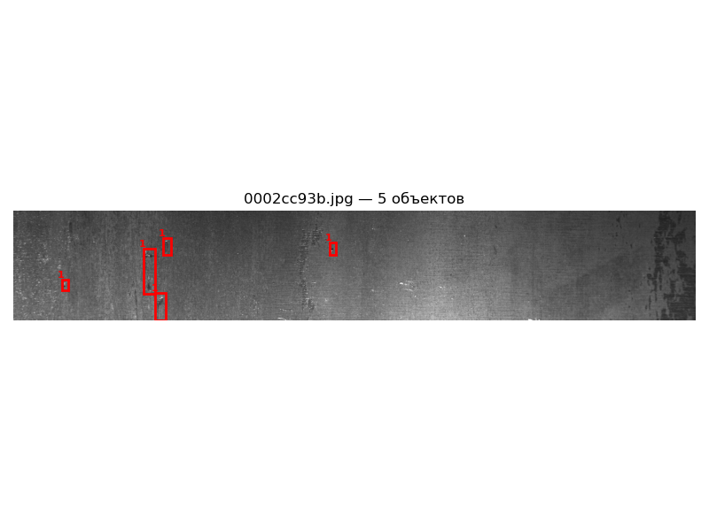
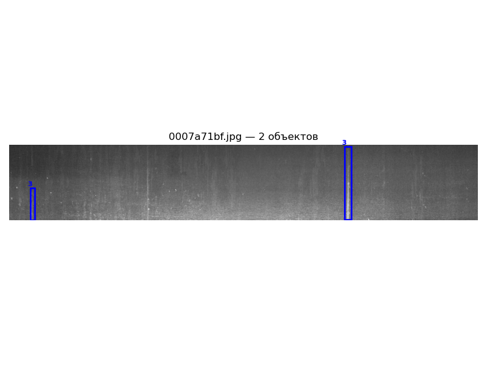
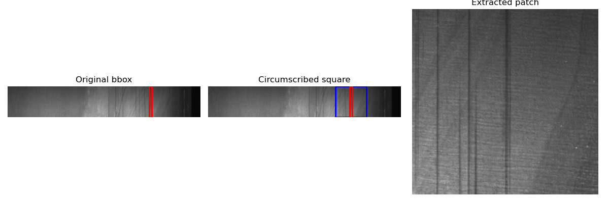
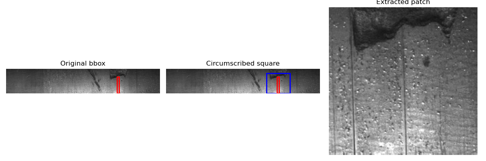
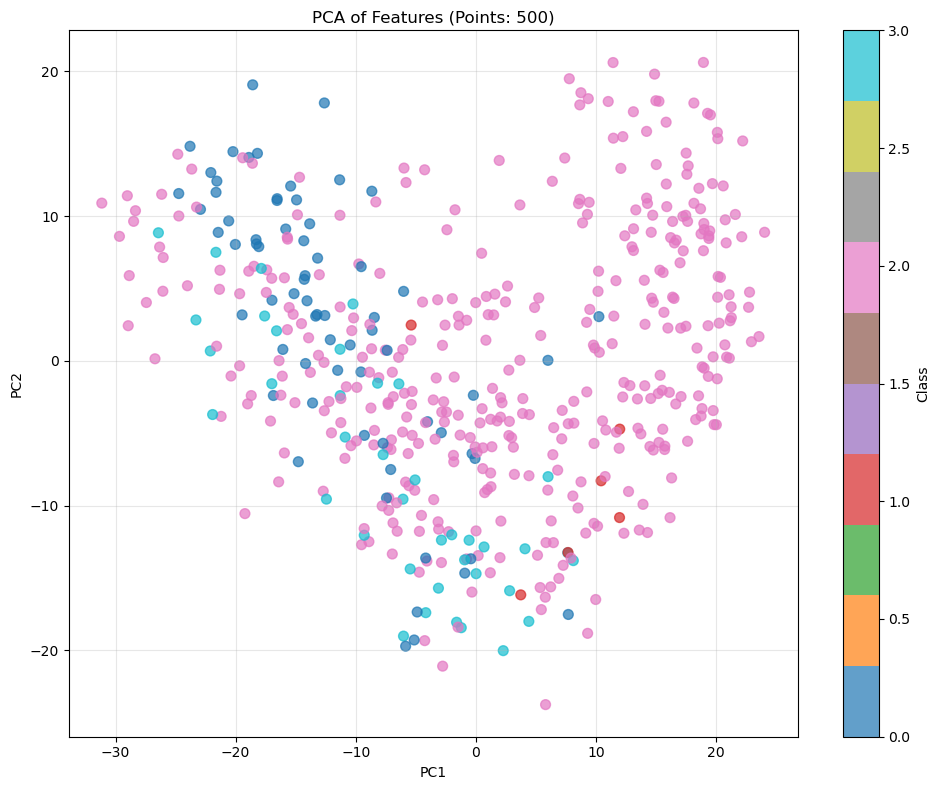
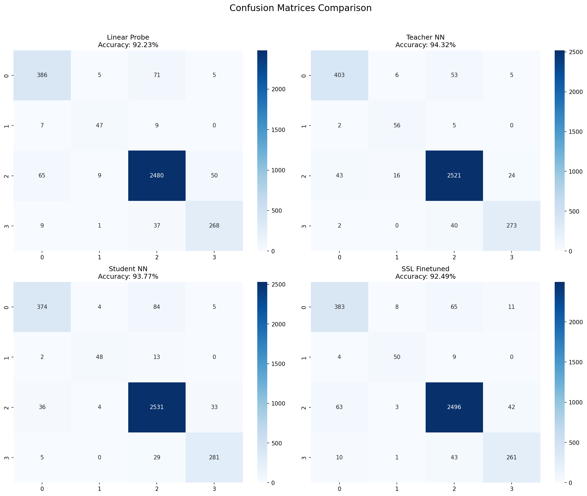

**Название проекта: DINOv2 Дистилляция для классификации дефектов**

**Краткое описание**  
Этот репозиторий содержит минимально жизнеспособный прототип (MVP) исследовательского пайплайна. Пайплайн реализует полный цикл эксперимента для проверки гипотезы о повышении эффективности классификации промышленных дефектов с помощью комбинации самоконтролируемой модели DINOv2 и дистилляции знаний. Решение представляет собой последовательность из семи скриптов, которые автоматизируют загрузку данных, предобработку, извлечение признаков, обучение и сравнительный анализ различных моделей-классификаторов.

**Скриншоты демонстрации**  
В ходе работы пайплайна генерируются следующие ключевые визуализации:  

 
\*Визуализация bounding boxes, извлеченных из RLE-разметки (шаг 1).\*



_Пример вырезанного патча дефекта с контекстом (шаг 2)._

[alt text](readme_images/features_pca.png)
\*PCA-проекция признаков, извлеченных предобученной DINOv2 (шаг 3).\*


\*PCA-проекция признаков после SSL-дообучения DINOv2 (шаг 5).\*


_Совмещенные матрицы ошибок (Confusion Matrix) всех финальных моделей (шаг 7)._

**Инструкция по установке и запуску**

1.  **Настройка Kaggle API:** Для скачивания датасета необходимо:
    
    *   Зарегистрироваться на [Kaggle](https://www.kaggle.com/).
        
    *   Создать API токен в настройках профиля (файл `kaggle.json`).
        
    *   Разместить его в локальной директории:
        
        ```bash
        git clone https://github.com/DaniilShd/project_seminar.git
        cd project_seminar
        pip install -r requirements.txt
        ```
        
2.  **Установка зависимостей:**
    
    ```bash
    
    git clone https://github.com/DaniilShd/project\_seminar.git
    cd project\_seminar
    pip install \-r requirements.txt
    ```
3.  **Последовательный запуск пайплайна:**  
    Все глобальные переменные (пути, гиперпараметры) хранятся в `config.yaml`.
    
    *   **Шаг 0: Скачивание датасета.** Выполните `python 00_download_data.py`. Скрипт скачает датасет, распакует его в рабочую директорию `dataset/` и удалит архив.
        
    *   **Шаг 1: Подготовка данных.** Запустите `python 01_prepare_data.py`. Скрипт преобразует разметку из формата RLE в JSON-аннотации с bounding boxes, декодируя маски для разных классов дефектов.
        
    *   **Шаг 2: Извлечение патчей.** Запустите `python 02_extract_patches.py`. Скрипт вырезает квадратные патчи фиксированного размера вокруг обнаруженных дефектов с дополнительным контекстом и сохраняет их для обучения.
        
    *   **Шаг 3: Извлечение базовых признаков.** Запустите `python 03_extract_features_dino.py`. Скрипт извлекает эмбеддинги (признаки) из патчей с помощью предобученной модели DINOv2 и визуализирует их распределение через PCA.
        
    *   **Шаг 4 (Опционально): SSL-дообучение.** Запустите `python 04_ssl_dino_finetune.py`. Скрипт дообучает DINOv2 с помощью самоконтролируемого обучения (momentum encoder) на патчах для улучшения представлений.
        
    *   **Шаг 5 (Опционально): Извлечение SSL-признаков.** Если шаг 4 выполнен, запустите `python 05_extract_ssl_dino.py` для извлечения признаков с помощью дообученной модели и их PCA-визуализации.
        
    *   **Шаг 6: Обучение моделей.** Запустите `python 06_train_models.py`. Скрипт обучает четыре модели: линейный классификатор на исходных признаках, нейросеть-учитель, дистиллированную нейросеть-студента и линейный классификатор на SSL-признаках (если доступны).
        
    *   **Шаг 7: Сравнение и анализ.** Запустите `python 07_compare_models.py`. Скрипт сравнивает производительность всех моделей, вычисляет метрики и генерирует итоговые отчеты.
        

**Список используемых пакетов**  
Основные зависимости перечислены в `requirements.txt`: torch, torchvision, scikit-learn, opencv-python, pandas, numpy, matplotlib, seaborn, pyyaml, kaggle.

**Лицензия**  
Проект распространяется под лицензией **MIT License**.

**Ссылка на презентацию**  
Презентация по проекту доступна в репозитории: `report/presentation.pdf`.

* * *

### Результаты и выводы

После выполнения пайплайна генерируется сводная таблица метрик:

| Model | Parameters | Accuracy | Inference Time | Compression | Improvement |
|-------|------------|----------|----------------|-------------|-------------|
| Linear Probe (Original) | 1540 | 92.23% | 1.57ms | — | — |
| Neural Network (Teacher) | 57796 | 94.32% | 43.40ms | — | — |
| Tiny Student (Distilled) | 26852 | 93.77% | 513.55µs | 2.2x | -0.55% |
| Linear Probe (SSL Finetuned) | 1540 | 92.49% | 1.08ms | — | +0.26% |

**Выводы на основании результатов:**

1.  **Высокое качество признаков DINOv2:** Точность базового линейного классификатора (92.23%) подтверждает, что самоконтролируемая модель DINOv2 извлекает мощные семантические признаки, пригодные для решения задачи "из коробки".
    
2.  **Эффективность дистилляции знаний:** Дистиллированная модель-ученик демонстрирует выдающийся баланс. Она сохраняет **99.4% точности** модели-учителя (падение всего на 0.55%), при этом имея **в 2.2 раза меньше параметров** и работая **более чем в 80 раз быстрее** (0.51 мс против 43.4 мс). Это делает её оптимальным кандидатом для развертывания в системах реального времени.
    
3.  **Умеренный эффект SSL-дообучения:** Дополнительное самообучение DINOv2 на целевом домене дало положительный, но небольшой прирост в точности линейного проба (+0.26%). Это указывает на правильность направления, но также показывает, что предобученные признаки уже являются очень сильными.
    
4.  **Практическая значимость:** Эксперимент подтверждает, что предложенный двухэтапный подход (использование признаков универсальной SSL-модели + их дистилляция в компактный классификатор) является эффективной методологией для создания точных и ресурсоэффективных решений для индустриального компьютерного зрения.
    