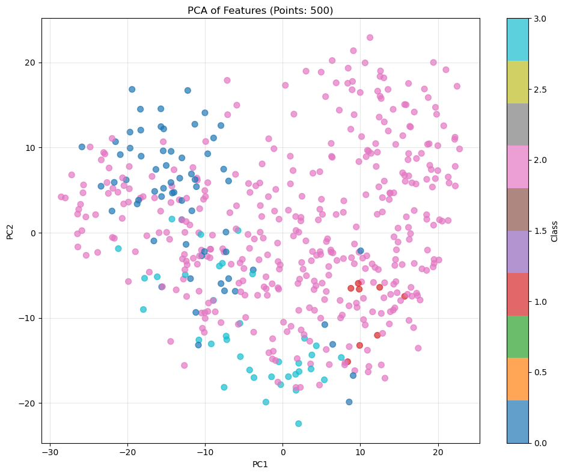

1) Для скачивания датасета необходимо зарегистрироваться на кагл, создать апи ключ и разместьить ее в нужную локальную директорию

mkdir -p ~/.kaggle
mv /путь/к/kaggle.json ~/.kaggle/
chmod 600 ~/.kaggle/kaggle.json

Все глобальные переменные хранятся в конфигурационном файле config.yaml.

2) скачивание датасета - выполнить скрипт 00_download_data.py. Скрипт скачает датасет в архивом. Распакует в рабочую директорию и удалит архив, чтобы не засорять память. 

3) Далее запускается скрипт 01_prepare_data.py для подготовки данных. Этот скрипт преобразует разметку в формате RLE (Run-Length Encoding) из CSV файла в JSON аннотации с bounding boxes. Он читает изображения с дефектами, декодирует маски для разных классов дефектов, извлекает контуры объектов и сохраняет координаты ограничивающих прямоугольников в JSON файл.

4) Далее скрипт 02_extract_patches.py. Этот скрипт вырезает квадратные патчи (фрагменты изображений) вокруг обнаруженных дефектов на металлической поверхности с дополнительным контекстом для анализа. Он сохраняет фрагменты фиксированного размера с аннотациями о типе дефекта и расположении для обучения моделей компьютерного зрения в промышленной инспекции качества.

5) Далее скрипт 03_extract_features_dino.py. Этот скрипт извлекает признаки из изображений дефектов металлической поверхности с помощью предобученной модели DINOv2, сохраняет эмбеддинги для последующего обучения классификаторов и визуализирует распределение признаков через PCA для анализа кластеризации типов дефектов.

6)  Далее скрипт 04_ssl_dino_finetune.py. Этот скрипт дообучает DINOv2 модель с помощью самоконтролируемого обучения на патчах изображений дефектов металлической поверхности. Он использует технику momentum encoder с двумя аугментациями изображений для создания согласованных представлений дефектов без явных меток, улучшая эмбеддинги для последующей классификации.

7) Далее скрипт 05_extract_ssl_dino.py. Этот скрипт извлекает фичи (признаки) из изображений дефектов металлической поверхности с помощью дообученной DINOv2 модели и визуализирует их в двумерном пространстве с помощью PCA для анализа кластеризации типов дефектов.

8) Далее скрипт 06_train_models.py. Этот скрипт обучает четыре модели классификации дефектов металлической поверхности: линейный классификатор на исходных фичах, нейросеть-учитель, сжатый дистиллированный студент и линейный классификатор на улучшенных фичах от дообученной SSL модели для сравнения эффективности.

9) Далее скрипт 07_compare_models.py. Этот скрипт сравнивает производительность четырех моделей классификации дефектов металлической поверхности на тестовых данных, измеряя точность, время инференса и коэффициенты сжатия, а также сохраняет confusion matrix для визуализации ошибок классификации каждого подхода.

RESULTS TABLE:
==========================================================================================
Model                               Parameters   Accuracy   Inference Time  Compression  Improvement
==========================================================================================
Linear Probe (Original)             1540         92.23%     1.57ms          NaN          NaN       
Neural Network (Teacher)            57796        94.32%     43.40ms         NaN          NaN       
Tiny Student (Distilled)            26852        93.77%     513.55µs        2.2x         -0.55%    
Linear Probe (SSL Finetuned)        1540         92.49%     1.08ms          NaN          +0.26%    
==========================================================================================

Выводы на основании результатов - прощу добавить 